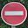
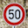

Traffic Sign Classification
====

***By Derrick Hathaway<br />
December 4, 2017***

<br />

## Files

- **README.md** This writeup
- **TrafficSignClassifier.ipynb** The Jupyter Notebook file containing the code and output of the network
- **samples/[sign].png** Some real-world example images of road signs gathered from the internet

<br />

## Data Summary and Exploration

The training data for this project consists of traffic sign images from the [German Traffic Sign Dataset](http://benchmark.ini.rub.de/?section=gtsrb&subsection=dataset).

The traffic sign images are divided into 3 datasets.

- The training data set consisting of 34,799 images
- The validation data set with 4,419 images
- The testing data set with 12,640 images

Each rgb image is represented by a 32x32x3 array of values in the range of 0-255. Below are a few images from the training dataset.


43 different road signs are represented in the dataset. The training labels are represented by a single number, the zero based index of the sign in the dataset. Here is a breakdown of the distribution.


You can see from the graph that the sample sizes from each sign vary significantly. For example there are over 2000 50km/h Speed Limit signs and only 180 20km/h Speed Limit signs. This presented a bit of a training challenge.

<br />

## Data Preprocessing

The following steps were taken to improve training performance.

- shuffled the training data
- normalized and mean-centered the data

<br />

## Model Architecture

For this classifier I have followed the LeNet architecture. Two convolutional layers each followed by a pooling layer, followed by a series of fully connected layers.


For the convolution layers I chose to use 'valid' padding with a stride of 1. The pooling layers have a a stride of 2x2x1 with 'valid' padding.

<br />

## Training

The final model was trained over `10` epochs with a batch size of `128`. In order to help the model generalize I used dropout at a rate of `50%`. I chose a learning rate of `0.001`.

I fed the output of TensorFlow's `softmax_cross_entropy_with_logits` with the one-hot encoded labels to the `reduce_mean` function and used the Adam Optimizer to minimize the loss.

After each epoch I ran the model against the validation data set to measure it's progress.

```
EPOCH 1 ...
Validation loss = 0.765
Validation accuracy = 0.787

EPOCH 2 ...
Validation loss = 0.416
Validation accuracy = 0.883

EPOCH 3 ...
Validation loss = 0.339
Validation accuracy = 0.909

EPOCH 4 ...
Validation loss = 0.290
Validation accuracy = 0.919

EPOCH 5 ...
Validation loss = 0.281
Validation accuracy = 0.925

EPOCH 6 ...
Validation loss = 0.257
Validation accuracy = 0.933

EPOCH 7 ...
Validation loss = 0.261
Validation accuracy = 0.934

EPOCH 8 ...
Validation loss = 0.248
Validation accuracy = 0.937

EPOCH 9 ...
Validation loss = 0.247
Validation accuracy = 0.940

EPOCH 10 ...
Validation loss = 0.270
Validation accuracy = 0.939
```

<br />

## Results

Performance of the final model against the 3 data sets are as follows:

- Training set: 99.2%
- Validation set: 93.9%
- Testing set: 93.7%

I set out to implement the LeNet architecture from the very start. In order to achieve a result better than 93% I iterated over several variations on the hyper parameters before finally settling on 10 epochs, a batch size of 128, a learning rate of 0.001. Later I added dropout because I was getting high accuracy on the training set but my validation accuracy was significantly lower and the tests I did on real world examples (images from the web) showed fairly low accuracy. This seemed to improve the generalization of the model.

<br />

## Some Real World Examples

|  | SoftMax Probabilities |
| ------------------------------ | ----------- |
| No Passing | 1.00000 |
| Dangerous curve to the left | 0.00000 |
| No passing for vehicles over 3.5 metric tons | 0.00000 |
| Dangerous curve to the right | 0.00000 |
| End of no passing | 0.00000 |

|  | SoftMax Probabilities |
| ------------------------------ | ----------- |
| Stop | 0.99988 |
| Speed limit (60km/h) | 0.00005 |
| Speed limit (50km/h) | 0.00004 |
| Speed limit (30km/h) | 0.00001 |
| Speed limit (80km/h) | 0.00001 |

|  | SoftMax Probabilities |
| ------------------------------ | ----------- |
| Yield | 1.00000 |
| No vehicles | 0.00000 |
| No passing | 0.00000 |
| Road work | 0.00000 |
| Speed Limit (60km/h) | 0.00000 |

|  | SoftMax Probabilities |
| ------------------------------ | ----------- |
| Keep right | 1.00000 |
| Speed limit (60km/h) | 0.00000 |
| Turn left ahead | 0.00000 |
| Roundabout mandatory | 0.00000 |
| End of all speed and passing limits | 0.00000 |

|  | SoftMax Probabilities |
| ------------------------------ | ----------- |
| No entry | 0.99919 |
| Stop | 0.00081 |
| Road work | 0.00000 |
| No passing | 0.00000 |
| Speed limit (30km/h) | 0.00000 |

|  | SoftMax Probabilities |
| ------------------------------ | ----------- |
| Speed limit (20km/h) | 0.88909 |
| Speed limit (30km/h) | 0.10868 |
| Speed limit (80km/h) | 0.00104 |
| Speed limit (120km/h) | 0.00080 |
| Speed limit (60km/h) | 0.00039 |

|  | SoftMax Probabilities |
| ------------------------------ | ----------- |
| Speed limit (50km/h) | 1.00000 |
| Speed limit (80km/h) | 0.00000 |
| Speed limit (30km/h) | 0.00000 |
| Speed limit (60km/h) | 0.00000 |
| Speed limit (100km/h) | 0.00000 |
