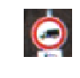
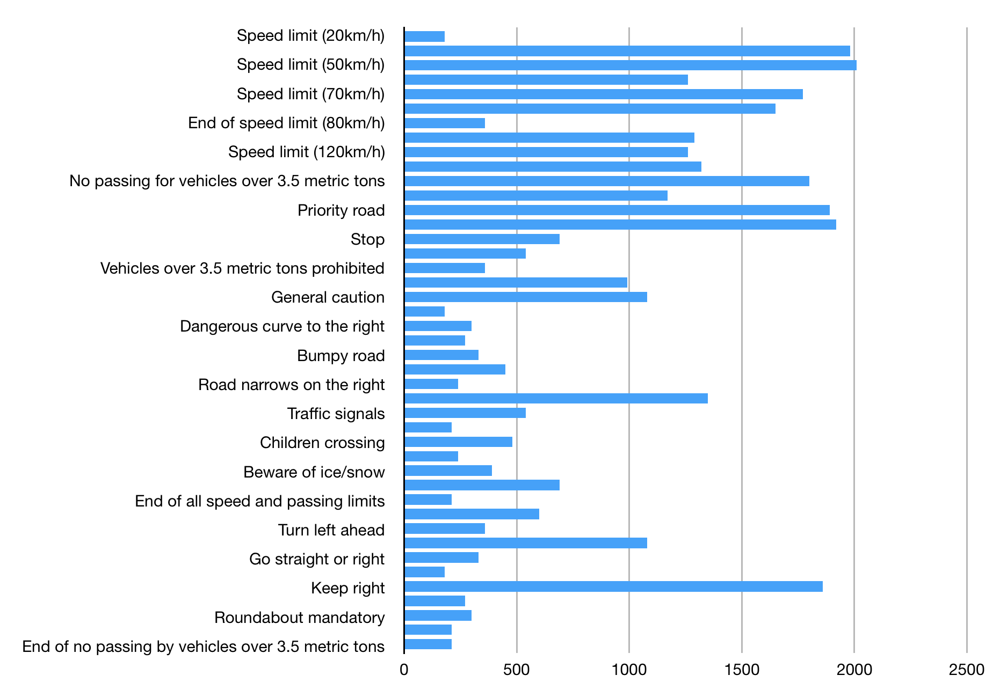

Traffic Sign Classification
====

###By Derrick Hathaway 
###December 4, 2017

 

##Files

- **README.md** This writeup
- **TrafficSignClassifier.ipynb** The Jupyter Notebook file containing the code and output of the network
- **samples/[sign].png** Some real-world example images of road signs gathered from the internet

 

## Data Summary and Exploration

The training data for this project consists of traffic sign images from the [German Traffic Sign Dataset](http://benchmark.ini.rub.de/?section=gtsrb&subsection=dataset).

The traffic sign images are divided into 3 datasets.

- The training data set consisting of 34,799 images
- The validation data set with 4,419 images
- The testing data set with 12,640 images

Each rgb image is represented by a 32x32x3 array of values in the range of 0-255. Below are a few images from the training dataset.

43 different road signs are represented in the dataset. Here is a breakdown of the distribution.

You can see from the graph that the sample sizes from each sign vary significantly. For example there are over 2000 50km/h Speed Limit signs and only 180 20km/h Speed Limit signs.
