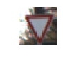
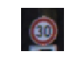
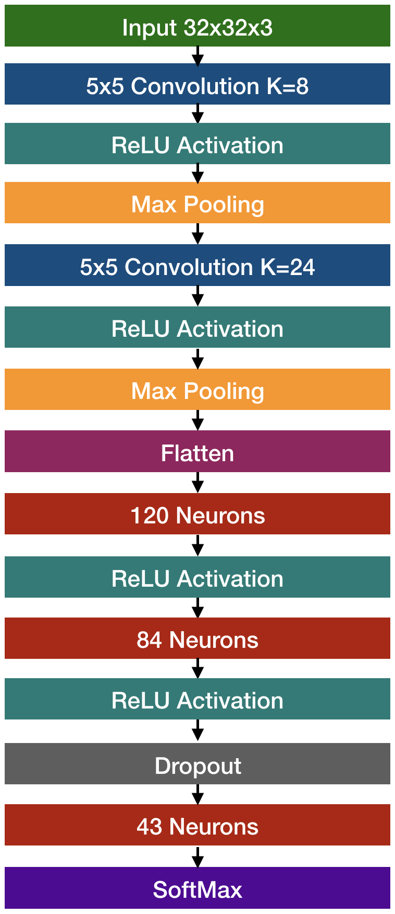

Traffic Sign Classification
====

***By Derrick Hathaway<br />
December 4, 2017***

<br />

## Files

- **README.md** This writeup
- **TrafficSignClassifier.ipynb** The Jupyter Notebook file containing the code and output of the network
- **samples/[sign].png** Some real-world example images of road signs gathered from the internet

<br />

## Data Summary and Exploration

The training data for this project consists of traffic sign images from the [German Traffic Sign Dataset](http://benchmark.ini.rub.de/?section=gtsrb&subsection=dataset).

The traffic sign images are divided into 3 datasets.

- The training data set consisting of 34,799 images
- The validation data set with 4,419 images
- The testing data set with 12,640 images

Each rgb image is represented by a 32x32x3 array of values in the range of 0-255. Below are a few images from the training dataset.





43 different road signs are represented in the dataset. The training labels are represented by a single number, the zero based index of the sign in the dataset. Here is a breakdown of the distribution.


You can see from the graph that the sample sizes from each sign vary significantly. For example there are over 2000 50km/h Speed Limit signs and only 180 20km/h Speed Limit signs. This presented a bit of a training challenge.

<br />

## Data Preprocessing

The following steps were taken to improve training performance.

- shuffled the training data
- normalized and mean-centered the data

<br />

## Model Architecture

For this classifier I have followed the LeNet architecture. Two convolutional layers each followed by a pooling layer, followed by a series of fully connected layers.



For the convolution layers I chose to use 'valid' padding with a stride of 1. The pooling layers have a a stride of 2x2x1 with 'valid' padding.

<br />

## Training

The final model was trained over 10 epochs with a batch size of 128. In order to help the model generalize I used dropout at a rate of 50%. I chose a learning rate of 0.001.

I fed the output of TensorFlow's `softmax_cross_entropy_with_logits` with the one-hot encoded labels to the `reduce_mean` function and used the Adam Optimizer to do the training.

After each epoch I ran the model against the validation data set to measure it's progress.

```
EPOCH 1 ...
Validation loss = 0.765
Validation accuracy = 0.787

EPOCH 2 ...
Validation loss = 0.416
Validation accuracy = 0.883

EPOCH 3 ...
Validation loss = 0.339
Validation accuracy = 0.909

EPOCH 4 ...
Validation loss = 0.290
Validation accuracy = 0.919

EPOCH 5 ...
Validation loss = 0.281
Validation accuracy = 0.925

EPOCH 6 ...
Validation loss = 0.257
Validation accuracy = 0.933

EPOCH 7 ...
Validation loss = 0.261
Validation accuracy = 0.934

EPOCH 8 ...
Validation loss = 0.248
Validation accuracy = 0.937

EPOCH 9 ...
Validation loss = 0.247
Validation accuracy = 0.940

EPOCH 10 ...
Validation loss = 0.270
Validation accuracy = 0.939
```